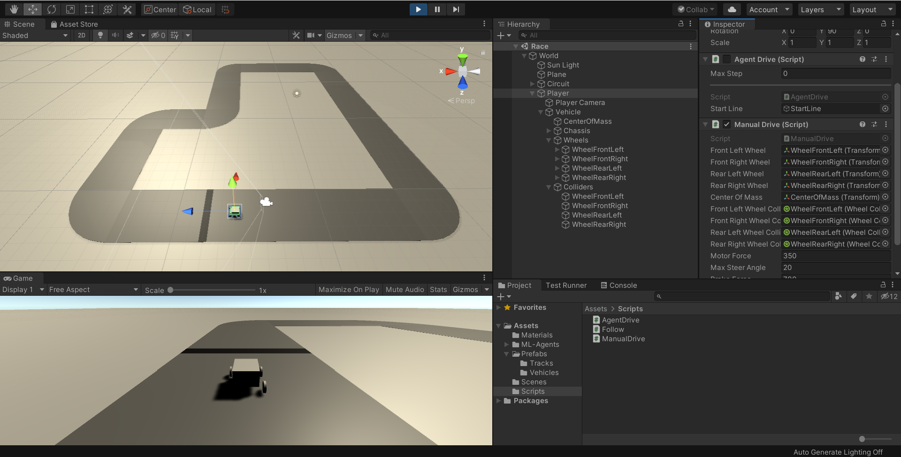
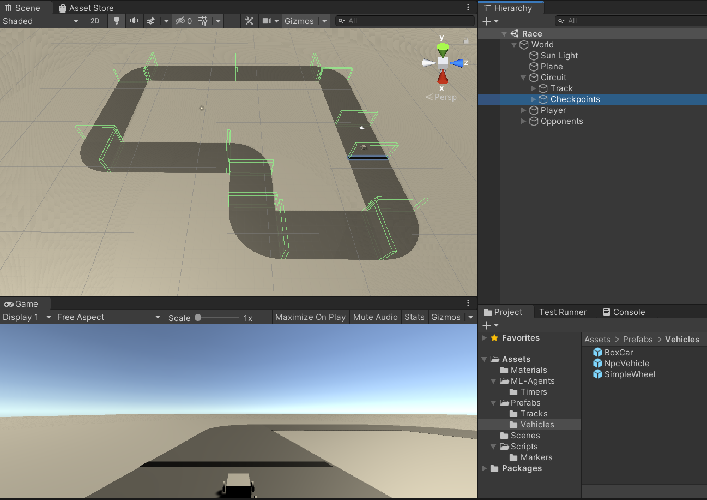
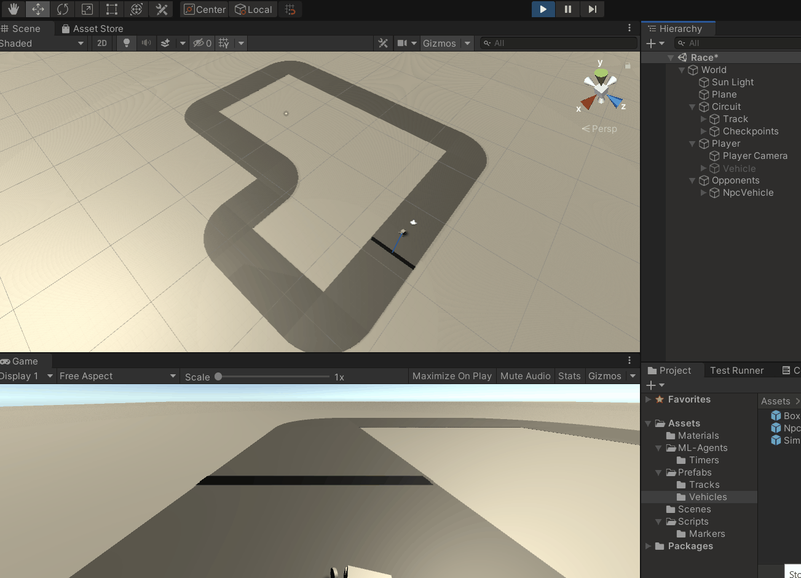
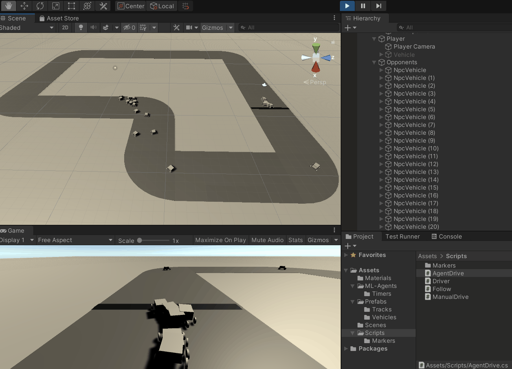
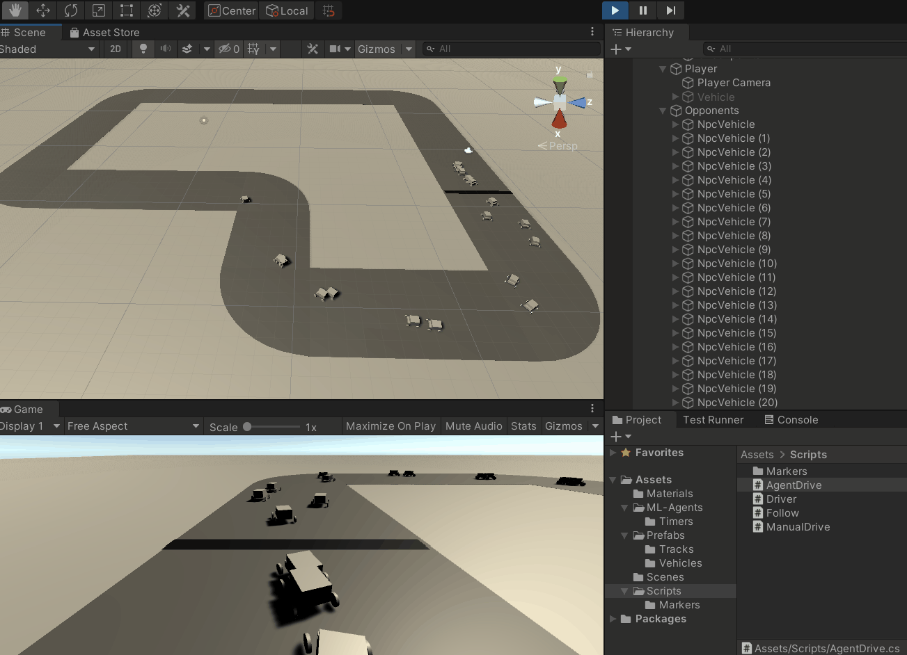
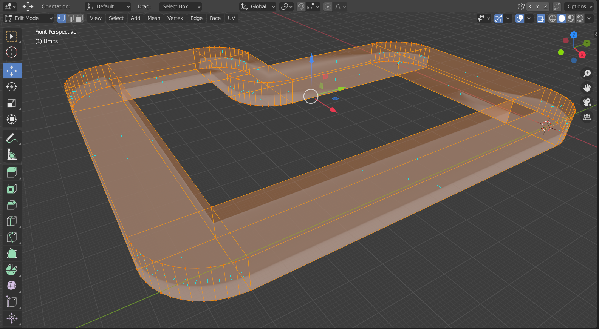
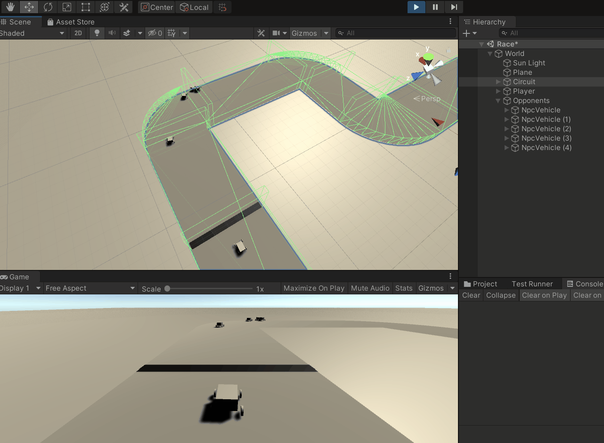

# History

## Iteration 0

Created the initial project structure with a sample track and a sample vehicle.

## Iteration 1

Added checkpoints as strategy for track mapping. Tried training a single agent.

## Iteration 2

Updated project to train 20 agents with a default PPO algorythm configuration.
The agents reached a third of the track.

## Iteration 3

To let the agents know more about the track, tried adding a separate mesh for the track limits.
The agents look lost, will try updating the algorithm onfiguration.

