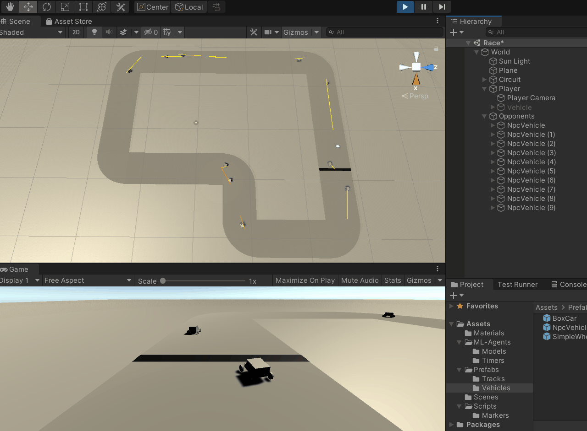
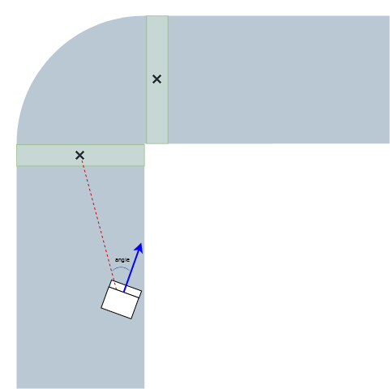
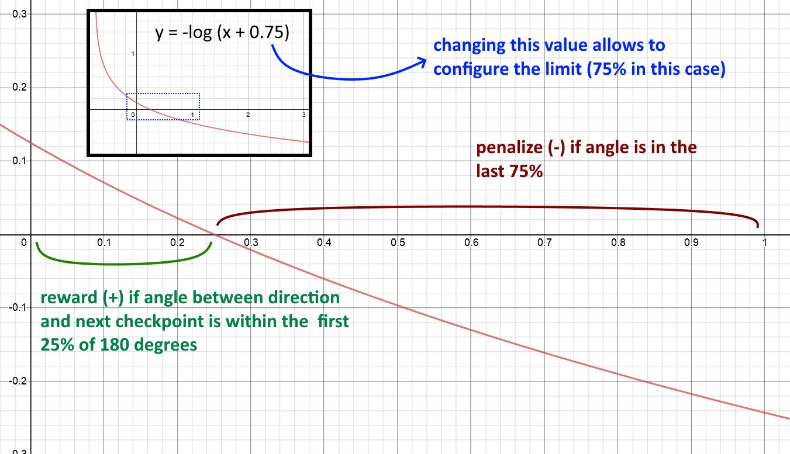

# History

## Iteration 0

Created the initial project structure with a sample track and a sample vehicle.

## Iteration 1

Added checkpoints as strategy for track mapping. Tried training a single agent.

## Iteration 2

Updated project to train 20 agents with a default PPO algorythm configuration.
The agents reached a third of the track.

## Iteration 3

To let the agents know more about the track, tried adding a separate mesh for the track limits.
The agents look lost, will try updating the algorithm onfiguration.

## Iteration 4

Updated agents to use RayPerceptionSensor components.

Tried different ways to reward/penalize until found a configuration that makes the agents complete the lap.

### Rewards are calculated as follows

- Local velocity: the Z component of the agent's local velocity is used. The greater its value, the greater the reward. If the agent is going in reverse the Z component is negative and the agent gets penalized (negative reward).

- Direction angle to checkpoint: first the angle between the agent direction (forward) and the position of the next checkpoint is calculated, then a function is used to get a reward/penalization depending on how large the angle is.

